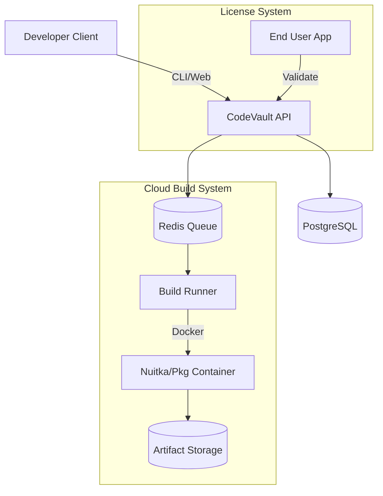

# CodeVault

<div align="center">


[](https://github.com/ParthSalunkhe7052/code-vault/actions)
[](LICENSE)
[](https://www.python.org/)
[](https://www.typescriptlang.org/)

**Secure, Monetize, and Distribute your Python & Node.js Applications.**

[Documentation](docs/README.md) • [CLI Reference](cli/README.md) • [Web Dashboard](frontend/README.md)

</div>

---

## 🚀 Overview

CodeVault is a comprehensive platform for developers to protect and monetize their software. It wraps your scripts with enterprise-grade license validation, hardware locking, and compiles them into native machine code to prevent reverse engineering.

It consists of two main components:
1.  **The Core Platform**: A web dashboard and API to manage licenses, customers, and cloud builds.
2.  **The Compiler**: A CLI tool and cloud service that injects protection and compiles your code.

## ✨ Key Features

| Feature | Description |
|---------|-------------|
| **🛡️ License Protection** | Embed remote license validation directly into your compiled executable. |
| **🔒 HWID Locking** | Bind licenses to specific hardware signatures (CPU, Motherboard, Disk). |
| **☁️ Cloud Build** | Compile Native Windows/Linux/Mac apps without local environment setup. |
| **🔨 Nuitka Power** | Uses Nuitka to compile Python to C, then to machine code. Not just a generic wrapper. |
| **⚡ Fast Mode** | Rapid iteration builds for development and testing cycles. |
| **📦 Node.js Support** | Full support for protecting and compiling Node.js applications. |
| **🔌 Offline Lease** | Allow applications to run offline for a configurable grace period (default 24h). |

## 🛠️ Quick Start

### 1. Installation

Install the CLI tool to get started with local management and builds.

```bash
pip install codevault-cli
```

### 2. Login

Authenticate with your CodeVault account.

```bash
codevault login
```

### 3. Initialize a Project

```bash
# Initialize in current directory
codevault init
```

### 4. Build & Protect

```bash
# Local compilation
codevault build

# Cloud compilation (no local dependencies)
codevault build --cloud
```

## 📖 Documentation

- **[Cloud Build Architecture](docs/cloud-build.md)**: How our remote compilation system works.
- **[API Reference](docs/api-reference.md)**: Integrate license checks into custom apps.
- **[CLI Reference](cli/README.md)**: Full command-line usage guide.
- **[Performance](docs/PERFORMANCE_OPTIMIZATION.md)**: Frontend optimization details.

## 🏗️ Architecture



## 💻 Tech Stack

- **Backend**: Python 3.12, FastAPI, SQLAlchemy
- **Frontend**: React 18, Vite, Tailwind CSS
- **Infrastructure**: Docker, Redis, Cloudflare R2
- **Compilation**: Nuitka (Python), Pkg (Node.js)

## 🤝 Contributing

We welcome contributions! Please see our [Contributing Guide](CONTRIBUTING.md) for details.

## 📄 License

This project is licensed under the MIT License - see the [LICENSE](LICENSE) file for details.
