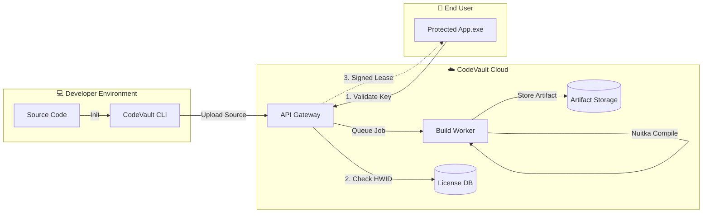

# CodeVault

<div align="center">

### **The Infrastructure for Selling Desktop Software.**
Secure, license, and distribute your Python & Node.js applications with a single command.

[](https://github.com/ParthSalunkhe7052/code-vault/actions)
[](LICENSE)
[]()

[**Documentation**](docs/README.md) • [**Web Dashboard**](frontend/README.md) • [**CLI Reference**](cli/README.md)

</div>

---

## ⚡ The Problem
You want to sell your Python/Node.js tool, but:
- **PyInstaller** builds are easily decompiled in seconds.
- **Licensing** requires setting up complex servers, databases, and payment gateways.
- **Hardware Locking** is error-prone and frustrates users.

## 💎 The Solution: CodeVault
CodeVault is an all-in-one platform that turns your script into a commercial product. We handle the **Compilation**, **Protection**, and **Licensing** so you can focus on the code.

### Features at a Glance

| Feature | Description |
| :--- | :--- |
| **🛡️ Native Compilation** | We don't just bundle. We compile Python to C (via Nuitka) and machine code, making reverse engineering prohibitively expensive. |
| **🔑 Enterprise Licensing** | Built-in support for **Offline Leases**, Floating Licenses, and Hardware ID (HWID) locking (Motherboard + CPU + Disk). |
| **⚡ Cloud Builds** | Compile native binaries for Windows, MacOS, and Linux without needing those OSs locally. |
| **💰 Stripe Integration** | (Beta) Automatically issue licenses upon payment. |
| **🔌 Offline-First** | Apps validate via a cryptographically signed lease. No constant internet connection required. |

---

## 🚀 Quick Start

Get your application protected and ready for sale in less than 5 minutes.

### 1. Install the CLI
```bash
pip install codevault-cli
```

### 2. Initialize Project
Navigate to your project root and generate the configuration.
```bash
codevault init --name "My Trading Bot" --type python
```

### 3. Build & Protect
Compile your app locally or on our cloud runners.
```bash
# Local Build (Uses Docker or local toolchain)
codevault build --release

# Cloud Build (Remote compilation)
codevault build --cloud --platform win64
```

> **Result:** A single, standalone executable `dist/MyTradingBot.exe` that prompts for a license key on startup.

---

## 🆚 Comparison

Why use CodeVault over other tools?

| Feature | **CodeVault** | PyInstaller / Pkg | PyArmor | Keygen.sh |
| :--- | :---: | :---: | :---: | :---: |
| **Decompilation Protection** | ⭐⭐⭐⭐⭐ (Native C) | ❌ (Easy) | ⭐⭐⭐⭐ (Obfuscation) | ❌ (API Only) |
| **License Management** | ✅ Built-in | ❌ | ❌ | ✅ |
| **Hardware Locking** | ✅ Automatic | ❌ | ✅ (Manual) | ✅ (API) |
| **Cloud Compilation** | ✅ | ❌ | ❌ | ❌ |
| **Web Dashboard** | ✅ | ❌ | ❌ | ✅ |

---

## 🏗️ Architecture

CodeVault bridges your local development environment with a secure cloud infrastructure.



## 💻 Tech Stack

- **CLI / Compiler:** Python 3.12, Nuitka, Typer
- **Backend:** FastAPI, SQLAlchemy, Redis
- **Frontend:** React 18, TypeScript, Tailwind CSS
- **Infrastructure:** Docker, Cloudflare R2

## 🤝 Contributing

We are open source! See [CONTRIBUTING.md](CONTRIBUTING.md) for how to run the stack locally.

## 📄 License

MIT © [CodeVault Team](https://github.com/ParthSalunkhe7052)
