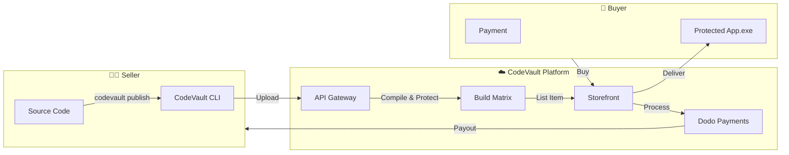

# CodeVault Marketplace

<div align="center">

### **The Marketplace for Desktop Software.**
Build, Protect, and Sell your Python & Node.js applications globally.

[](https://github.com/ParthSalunkhe7052/code-vault/actions)
[](LICENSE)
[]()

[**For Sellers**](docs/sellers-guide.md) • [**For Buyers**](docs/buyers-guide.md) • [**Web Store**](https://store.codevault.app)

</div>

---

## ⚡ The Problem
You have a great Python script or Node.js tool (e.g., a scraper, bot, or utility).
- **Selling is hard:** You need a website, payment gateway, license server, and auto-updater.
- **Piracy is rampant:** Sending a `.zip` file means your code is stolen instantly.
- **Compliance is a nightmare:** Handling VAT/GST for global sales is complex.

## 💎 The Solution: CodeVault Marketplace
CodeVault is the first marketplace for **protected** desktop software. You upload code, we protect it, and buyers download a secure binary.

### For Sellers 👨‍💻
*   **Zero-Config Sales:** Just run `codevault publish`. We generate a landing page instantly.
*   **Native Protection:** Your code is compiled to C/Machine code (Nuitka). No source code is ever distributed.
*   **Merchant of Record:** We handle all payments, fraud, and taxes. You just get a payout.

### For Buyers 🛒
*   **Instant Access:** Buy and download immediately.
*   **Verified Software:** All tools are scanned for malware.
*   **Auto-Updates:** Always get the latest version.

---

## 🚀 Seller Quick Start

Turn your script into a product in 3 steps.

### 1. Install the CLI
```bash
pip install codevault-cli
```

### 2. Login & Init
```bash
codevault login
codevault init --name "Super Scraper" --price 49.00
```

### 3. Publish to Store
```bash
codevault publish
```

> **Result:** A live store page at `store.codevault.app/p/super-scraper`. When a user buys it, they get a protected EXE, and you get paid.

---

## 🆚 Comparison

| Feature | **CodeVault** | Gumroad | CodeCanyon |
| :--- | :---: | :---: | :---: |
| **Code Protection** | ⭐⭐⭐⭐⭐ (Native Binary) | ❌ (Zip File) | ❌ (Source Code) |
| **Piracy Prevention** | ✅ HWID Locking | ❌ | ❌ |
| **Seller Experience** | ✅ CLI-First | ❌ Web Only | ❌ Web Only |
| **Global Payouts** | ✅ | ✅ | ✅ |
| **Auto-Updates** | ✅ | ❌ | ❌ |

---

## 🏗️ Architecture

CodeVault connects Developers (Sellers) with Users (Buyers) via a secure, automated pipeline.



## 💻 Tech Stack

- **Backend:** FastAPI, Python 3.12
- **Frontend:** React, Tailwind CSS
- **Marketplace:** Dodo Payments (MoR)
- **Compilation:** Nuitka, Docker

## 📄 License

MIT © [CodeVault Team](https://github.com/ParthSalunkhe7052)