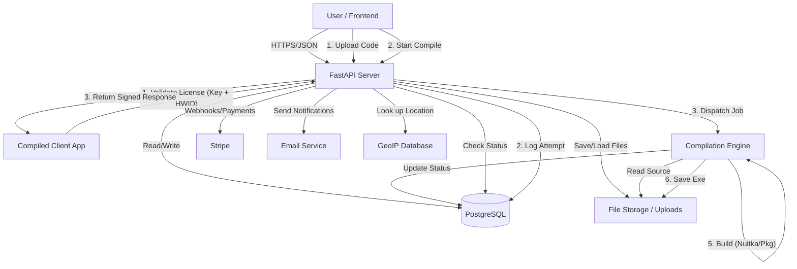
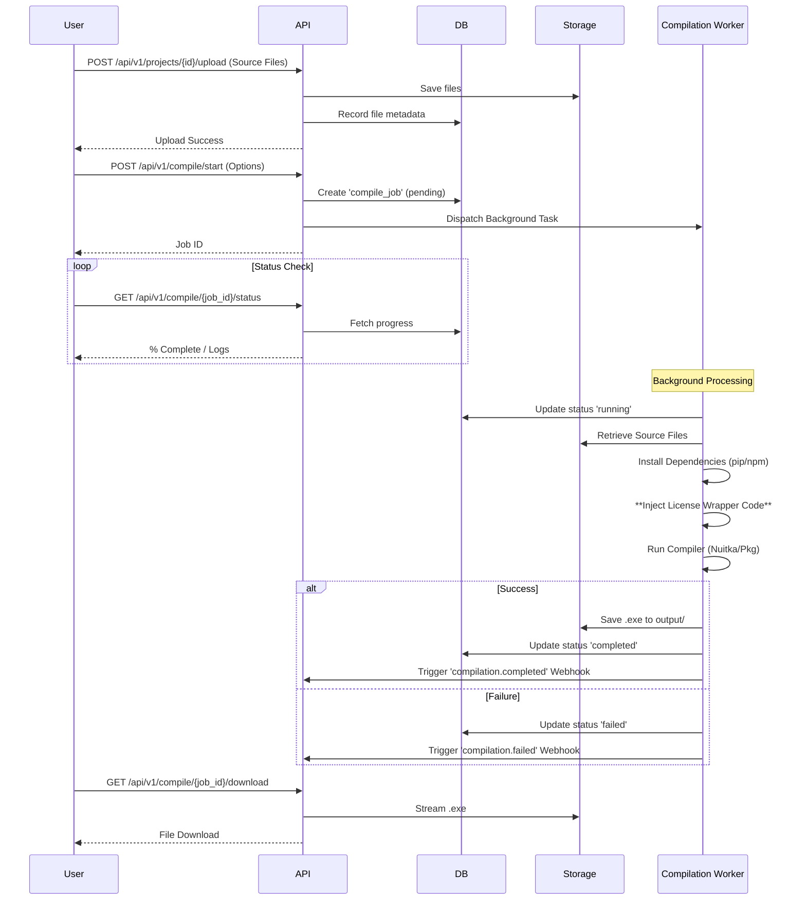
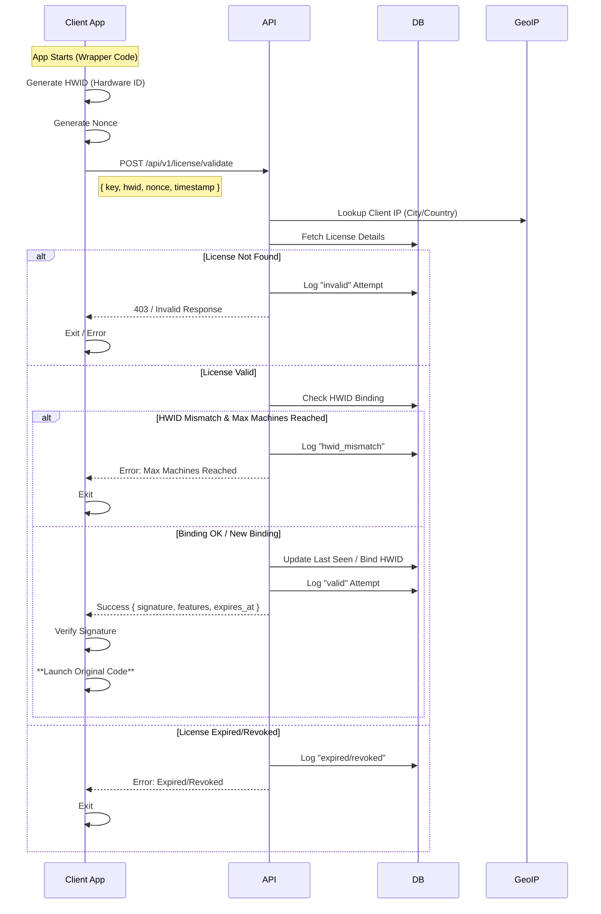

# CodeVault Data Flow Analysis

This document outlines the data flow within the CodeVault system, based on the `server/main.py` implementation.

## System Architecture

The system is built on **FastAPI** (Python) using **PostgreSQL** for persistence and a local/cloud file storage abstraction.

## detailed Flows

### 1. Project Compilation Flow

This process converts user source code into a license-protected executable.

### 2. License Validation Flow

This is the runtime check performed by the compiled application.

## Data Models (Simplified)

*   **Users**: `id`, `email`, `password_hash`, `api_key`, `plan`
*   **Projects**: `id`, `user_id`, `name`, `language`, `settings` (JSON)
*   **ProjectFiles**: `id`, `project_id`, `file_path`, `is_cloud`
*   **Licenses**: `id`, `project_id`, `license_key`, `expires_at`, `max_machines`, `features` (JSON)
*   **HardwareBindings**: `id`, `license_id`, `hwid`, `machine_name`
*   **ValidationLogs**: `id`, `license_key`, `ip_address`, `result`, `geo_data`
*   **Webhooks**: `id`, `user_id`, `url`, `events` (JSON)
