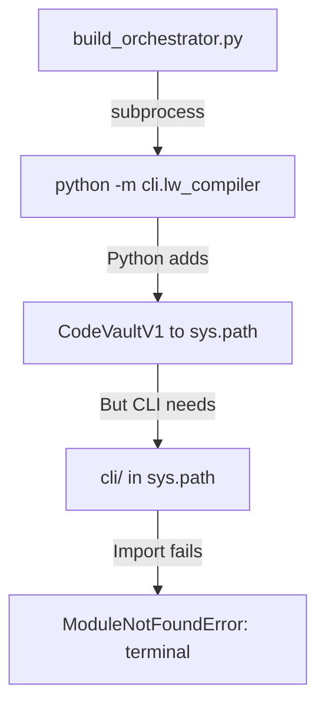

# 🕵️ Inspector Report: Python Build System Deep Dive

**Date:** December 23, 2024  
**Scope:** Complete Python build system failure analysis  
**Severity:** 🔴 Critical (Build System Architecture Issue)

---

## Executive Summary

The Python build system has a **fundamental architecture mismatch**. The build orchestrator invokes the CLI module via subprocess, but the CLI module was designed to run standalone with relative imports. This is incompatible with `python -m` invocation.

---

## 🔴 Root Cause Analysis

### The Problem Chain



### Import Structure in `lw_compiler.py`

```python
# Line 32-37 - These are BARE IMPORTS (not package-relative)
from terminal import Colors, color_print, print_header
from cli_config import load_config, save_config, ...
from wrappers import get_python_wrapper, get_nodejs_wrapper
```

**These imports require `cli/` directory to be in `sys.path`**. When running:
- `cd cli && python lw_compiler.py` → ✅ Works (CWD = cli)
- `python -m cli.lw_compiler` from CodeVaultV1 → ❌ Fails (CWD = CodeVaultV1, not cli)

### Why Node.js Works

| Aspect | Python Build | Node.js Build |
|--------|--------------|---------------|
| **Invocation** | Subprocess: `python -m cli.lw_compiler` | Direct import: `from .nodejs_compiler import NodeJSCompiler` |
| **Module location** | External `cli/` directory | Same `compilers/` directory |
| **Path dependency** | Requires `cli/` in sys.path | No external path needed |

---

## 🛠️ Fix Options

### Option A: Fix CLI Imports (Convert to Package)
Convert `cli/` to a proper Python package with relative imports.

**Changes:**
1. Add `cli/__init__.py`
2. Change imports in `lw_compiler.py`:
   ```python
   # FROM:
   from terminal import Colors
   # TO:
   from cli.terminal import Colors
   ```

**Pros:** Minimal changes, keeps CLI as subprocess  
**Cons:** Breaks standalone `python lw_compiler.py` usage

---

### Option B: Refactor Like Node.js (Recommended)
Create a Python compiler class similar to `nodejs_compiler.py`, eliminating subprocess.

**Changes:**
1. Create `server/compilers/python_compiler.py` 
2. Move core logic from `lw_compiler.py` into class methods
3. Direct import in `build_orchestrator.py`:
   ```python
   from .python_compiler import PythonCompiler
   compiler = PythonCompiler()
   await compiler.compile(...)
   ```

**Pros:** Matches Node.js architecture, no path issues, cleaner  
**Cons:** More work, but proper long-term solution

---

### Option C: Quick Fix (Add cli/ to Python Path)
Modify subprocess call to add `cli/` to PYTHONPATH.

**Changes in `build_orchestrator.py`:**
```python
env = os.environ.copy()
env['PYTHONPATH'] = str(Path(__file__).parent.parent / 'cli')
process = await asyncio.create_subprocess_exec(
    *cmd,
    env=env,
    cwd=str(codevault_root)
)
```

**Pros:** Quickest fix, single line change  
**Cons:** Hacky, doesn't fix architecture

---

## 📊 Recommendation

**Implement Option C (Quick Fix) now, plan Option B for later.**

Option C immediately fixes the build. Option B should be scheduled as a proper refactoring task.

---

## Files Affected

| File | Issue |
|------|-------|
| [build_orchestrator.py](file:///c:/Users/parth/OneDrive/Desktop/Code%20Vault/CodeVaultV1/server/compilers/build_orchestrator.py) | Needs PYTHONPATH env var |
| [lw_compiler.py](file:///c:/Users/parth/OneDrive/Desktop/Code%20Vault/CodeVaultV1/cli/lw_compiler.py) | Bare imports (OK for standalone) |

---

*Inspector out.* 🕵️
